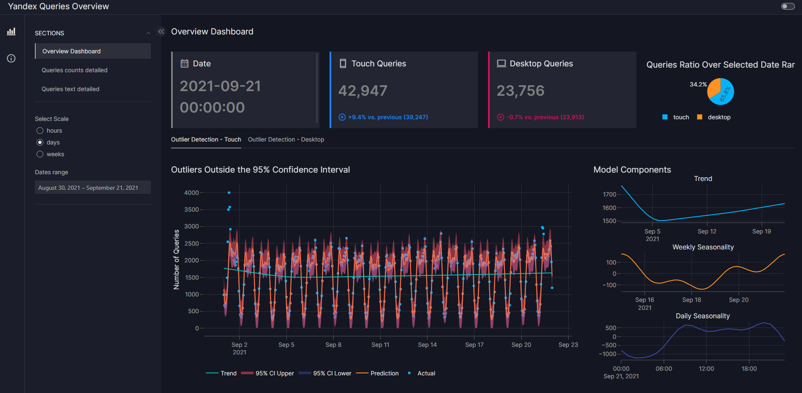
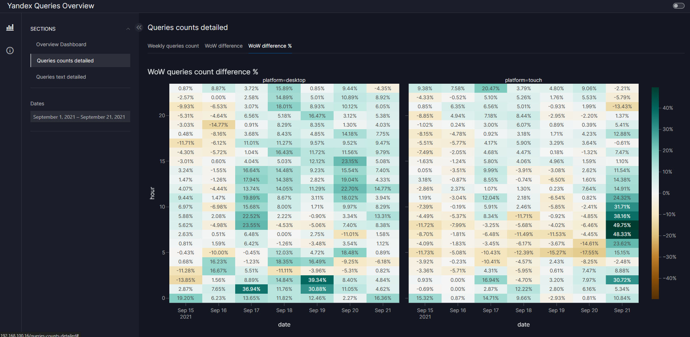
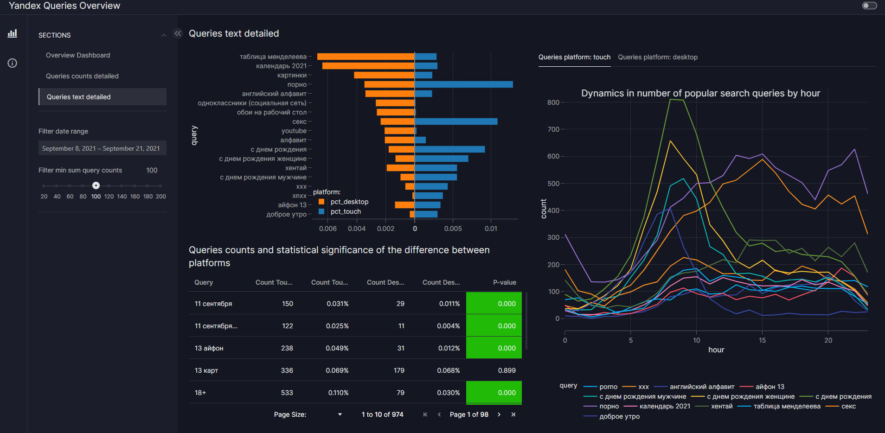

# Дашборд Yandex Queries Overview

## Установка

Для установки необходимо предварительно загрузить данные dataset.zip в PostgreSQL согласно описанию колонок данных раздела 1.
Запуск может выполнен в контейнере Docker. При этом необходимо указать в переменной окружения 
```
docker build -t yandex_dashboard:1 -e dbconnect=<YOUR_CONNECTION STRING> .
```

## 1. Источник данных

В данном проекте анализируются данные о поисковых запросах Yandex за период с 2021-09-01 по 2021-09-21. Всего в датасете содержится 1,2 миллиона записей, хранящихся в scv-файле.

### Поля датасета:
- `ts`: Дата и время запроса.
- `query` : Текст поискового запроса.
- `platform` ("desktop", "touch"): Платформа пользователя.

Для удобства работы с данными:
- Все тексты запросов были приведены к нижнему регистру, а символ `ё` заменён на `е`.
- Данные были загружены в базу данных PostgreSQL, размещённую на [Supabase](https://supabase.com/).

Были созданы два объекта базы данных:
1. **Таблица `yandex_data`**: Содержит исходные данные (`ts`, `platform`, `query`).
2. **Материализованное представление `yandex_data_agg`**: Агрегированные данные по часам, дням, неделям и платформам. Поля:
   - `ts`, `scale`, `platform`, `count`.
  ```sql
  CREATE MATERIALIZED VIEW vizro.yandex_data_agg as
SELECT
    date_trunc('h', ts) AS ds, 
    'hours' AS scale,
    platform,
    count(*) AS count
FROM vizro.yandex_data yd 
GROUP BY date_trunc('h', ts), platform

UNION 

SELECT
    date_trunc('d', ts) AS ds, 
    'days' AS scale,
    platform,
    count(*) AS count
FROM vizro.yandex_data yd 
GROUP BY date_trunc('d', ts), platform

UNION 

SELECT
    date_trunc('week', ts) AS ds, 
    'weeks' AS scale,
    platform,
    count(*) AS count
FROM vizro.yandex_data yd 
GROUP BY date_trunc('week', ts), platform

ORDER BY ds;
  
  ```

### Индексация:
Для каждого столбца были созданы индексы типа B-tree для ускорения выполнения запросов. Однако значительного прироста производительности в данном сценарии это не дало.

## 2. Структура дашборда

Дашборд состоит из трёх страниц:

### **1. Общий обзор (Overview Dashboard)**



На основной странице представлен количественный обзор динамики запросов во времени:

- Срезы времени:
  - По часам.
  - По дням.
  - По неделям.
- Разделение по платформам.

#### Ключевые особенности:

- **Выбор диапазона дат:** Позволяет фильтровать данные по выбранным датам. Срез по месяцам не используется из-за ограниченного объёма данных (3 недели).
- **Круговая диаграмма:** Отображает долю запросов по платформам. Около 75% запросов было сделано с мобильных устройств (платформа: `touch`).
- **Линейный график:** Показывает динамику запросов по платформам за выбранный диапазон дат с почасовой детализацией.
- **Обнаружение аномалий:**
  - Используется предсказательная модель на основе библиотеки [Prophet](https://facebook.github.io/prophet/) для выявления выбросов.
  - Качество модели:
    - MAE: 80.
    - MAPE: 20.55%.
  - Значения за пределами 95%-го доверительного интервала считаются аномалиями.
- **Компоненты тренда:** Построены отдельные графики для общего, недельного и дневного трендов, чтобы визуализировать сезонные паттерны.

### **2. Детализация количества запросов (Queries Counts Detailed)**



На этой странице представлены детализированные данные о количестве запросов:

- **Тепловые карты:**
  - Отображают количество запросов по часам для каждого дня за последние 7 дней.
  - Показывают различия неделя к неделе в абсолютных значениях и процентах.
Графики наглядно отображают недельные и дневные паттерны, характерные для каждой платформы.
- **Выбор диапазона дат:** Позволяет фильтровать данные по выбранным датам.
### **3. Детализация текста запросов (Queries Text Detailed)**

Эта страница посвящена анализу текста популярных запросов:

#### Ключевые особенности:

1. **Диаграмма-бабочка (Butterfly Chart):**

   - Отображает топ-10 самых популярных запросов для обеих платформ.
   - Сравнивает доли запросов как процент от общего числа запросов на каждой платформе.
   - Пример:
     - Запрос "обои на рабочий стол" составляет 0.26% от всех запросов для платформы `desktop`, но только 0.01% для платформы `touch`. Это логично, учитывая специфику использования платформ.

2. **Линейные графики:**

   - Показывают почасовую динамику для топ-5 популярных запросов на каждой платформе.
   - Отражают тренды, соответствующие типичному графику работы и отдыха пользователей.
   - Примечание: Дополнительный шум в данных связан с отсутствием информации о часовом поясе пользователей.

3. **Таблица данных:**

   - Содержит данные о количестве и доле запросов за выбранный диапазон времени, разбитые по платформам.
   - Включает колонку `p-value`, рассчитанную с использованием критерия хи-квадрат для проверки статистической значимости различий в долях запросов:
     - Зелёные ячейки (`p-value < 5%`) указывают на значимые различия, предполагая платформенную специфику запросов.
     - Отсутствие зелёной заливки указывает на отсутствие значимых различий в частоте запросов между платформами.

- **Выбор диапазона дат:** Позволяет фильтровать данные по выбранным датам.
- **Фильтр минимального количества поисковых запросов**, для отбражения на дашборде
---

Этот дашборд предоставляет анализ поисковых запросов, выявляя ключевые паттерны и тренды по платформам и времени. Использование методов обнаружения аномалий и статистического тестирования обеспечивает обнаружение полезных инсайтов.
